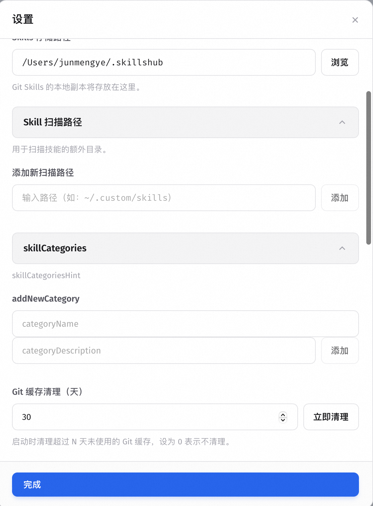
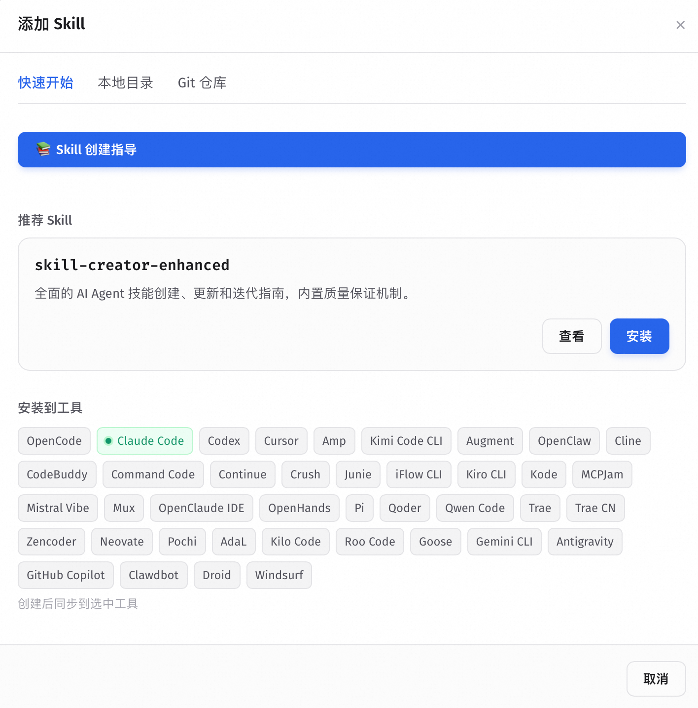
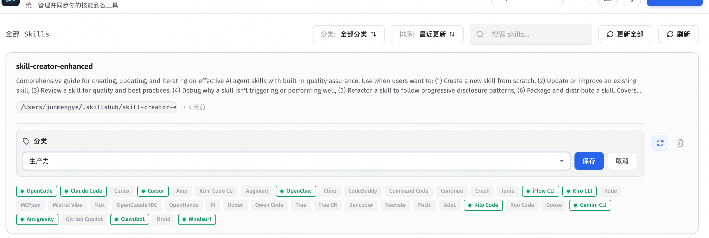
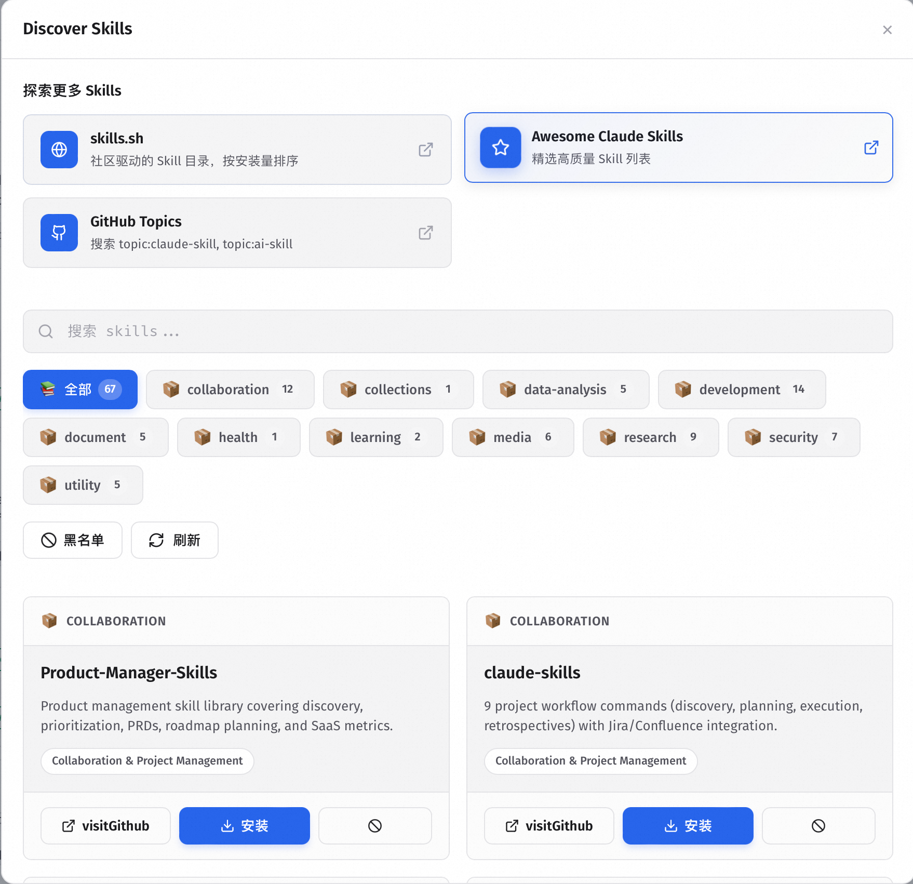
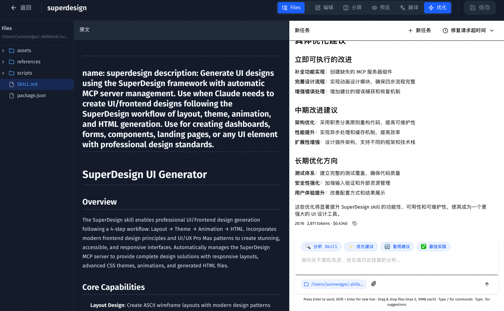
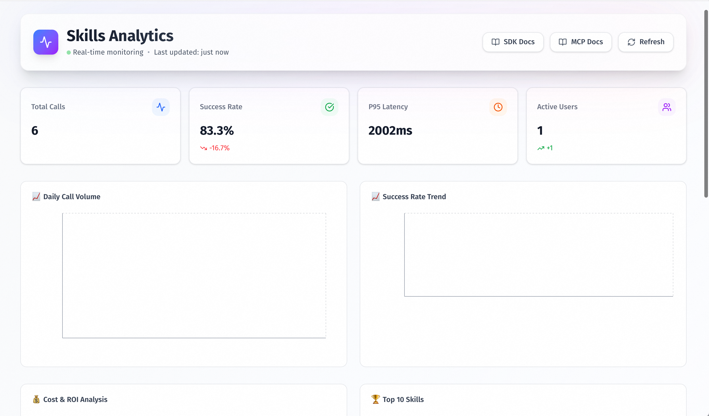

# Skills Hub (Tauri Desktop)

A cross-platform desktop app (Tauri + React) to manage Agent Skills in one place and sync them to multiple AI coding tools' global skills directories (prefer symlink/junction, fallback to copy) — "Install once, sync everywhere".

Thanks to the original author for their selfless contribution. Original project address:

https://github.com/qufei1993/skills-hub

Modification Notes: This project has undergone significant feature expansion and performance optimization based on the original project.

Due to the large scope of code changes and numerous conflicts, each item has not yet been submitted for review.

Major new features include:
- Support for custom scan paths;

- Support for custom Skill directories, configuration directories, and display instructions;

- Clicking on a Skill allows viewing details, including a file tree preview, original content, translation, and AI optimization suggestions;

- Provides a Skill usage dashboard and supports reporting usage data via SDK or MCP protocol;

- Enables automatic Skill discovery and one-click installation;

- Includes commonly used Skills and integrates an enhanced Skill Creator tool.

- The current AI optimization module is relatively simple, as its core capabilities are being deeply refined in another independent project. This Skill Hub management system is actually a sub-module of that main project.

- The project goal is to build a complete data loop and self-evolution capabilities. Once the relevant functions are perfected, they will be open-sourced at an opportune time.

## Documentation

- English (default): `README.md` (this file)
- 中文：[`README.zh.md`](README.zh.md)

Design docs:

- System design (EN): [`docs/system-design.md`](docs/system-design.md)
- 系统设计（中文）：[`docs/system-design.zh.md`](docs/system-design.zh.md)

## Key Features

### 🎯 Unified Management View
- Centralized display of all managed Skills and their activation status across tools
- Real-time view of each Skill's source, update time, and sync status
- Support for sorting by update time/name, keyword search, and category filtering
  
  
  

### 🔄 Smart Sync Mechanism
- **Hybrid Sync Strategy**: Prefers symlink/junction, automatically falls back to copy in restricted environments
- **Multi-tool Support**: Supports 40+ AI coding tools including Cursor, Claude Code, Codex, Windsurf, and more
- **Conflict Detection**: Automatically detects target directory conflicts with clear error messages and solutions

### 📦 Multiple Import Methods
- **Local Folder Import**: Import Skills from local directories
- **Git Repository Import**: Supports GitHub URLs with automatic parsing and cloning
- **Multi-Skill Repository Selection**: Intelligently detects repositories containing multiple Skills with candidate selection UI
- **Quick Install**: Built-in recommended Skills for one-click installation

### 🔍 Skill Discovery & Browsing & Install
- **Discovery Marketplace**: Browse community-curated Skills with category filtering and search
- **GitHub Integration**: Search GitHub repositories and install directly
- **Auto Sync**: Automatically syncs awesome-claude-skills database
  

### 📝 Skill Details & Editing
- **File Explorer**: View complete file structure of Skills
- **Multi-mode Editor**:
  - **Edit Mode**: Direct editing with EasyMDE editor and Markdown syntax highlighting
  - **Preview Mode**: Real-time rendering with React Markdown, supporting code, math formulas, and Mermaid diagrams
  - **Split Mode**: Edit and preview side-by-side with real-time sync
  - **Translate Mode**: One-click translation with support for multiple translation services (Google, LibreTranslate)
  - **Optimize Mode**: Integrated AI chat panel for intelligent Skill optimization
- **Auto-save**: Automatically saves changes with manual save option
  

### 📊 Analytics
- **Invocation Tracking**: Records Skill invocation counts, success rates, duration, and other metrics
- **Trend Analysis**: Visualizes usage trends and popular Skills
- **Cost Analysis**: Statistics on API call costs
- **User Retention**: Analyzes user behavior and retention rates
- **Alert System**: Automatic alerts for abnormal usage patterns
  

### 🛠️ MCP Server Integration
Built-in **MCP (Model Context Protocol) Server** enabling Claude AI to directly track Skill invocations and query analytics data without writing code.

### ⚙️ Advanced Features
- **Auto Update**: Supports automatic update detection for Git Skills
- **Cache Management**: Intelligent cleanup of Git cache and temporary files
- **Theme Switching**: Supports light, dark, and system themes
- **Internationalization**: Supports Chinese and English interfaces
- **Translation Services**: Integrated Google Translate, LibreTranslate, and other translation services


## Supported AI Coding Tools

| tool key | Display name | skills dir (relative to `~`) | detect dir (relative to `~`) |
| --- | --- | --- | --- |
| `cursor` | Cursor | `.cursor/skills` | `.cursor` |
| `claude_code` | Claude Code | `.claude/skills` | `.claude` |
| `codex` | Codex | `.codex/skills` | `.codex` |
| `opencode` | OpenCode | `.config/opencode/skills` | `.config/opencode` |
| `antigravity` | Antigravity | `.gemini/antigravity/global_skills` | `.gemini/antigravity` |
| `amp` | Amp | `.config/agents/skills` | `.config/agents` |
| `kimi_cli` | Kimi Code CLI | `.config/agents/skills` | `.config/agents` |
| `augment` | Augment | `.augment/rules` | `.augment` |
| `openclaw` | OpenClaw | `.moltbot/skills` | `.moltbot` |
| `cline` | Cline | `.cline/skills` | `.cline` |
| `codebuddy` | CodeBuddy | `.codebuddy/skills` | `.codebuddy` |
| `command_code` | Command Code | `.commandcode/skills` | `.commandcode` |
| `continue` | Continue | `.continue/skills` | `.continue` |
| `crush` | Crush | `.config/crush/skills` | `.config/crush` |
| `junie` | Junie | `.junie/skills` | `.junie` |
| `iflow_cli` | iFlow CLI | `.iflow/skills` | `.iflow` |
| `kiro_cli` | Kiro CLI | `.kiro/skills` | `.kiro` |
| `kode` | Kode | `.kode/skills` | `.kode` |
| `mcpjam` | MCPJam | `.mcpjam/skills` | `.mcpjam` |
| `mistral_vibe` | Mistral Vibe | `.vibe/skills` | `.vibe` |
| `mux` | Mux | `.mux/skills` | `.mux` |
| `openclaude` | OpenClaude IDE | `.openclaude/skills` | `.openclaude` |
| `openhands` | OpenHands | `.openhands/skills` | `.openhands` |
| `pi` | Pi | `.pi/agent/skills` | `.pi` |
| `qoder` | Qoder | `.qoder/skills` | `.qoder` |
| `qwen_code` | Qwen Code | `.qwen/skills` | `.qwen` |
| `trae` | Trae | `.trae/skills` | `.trae` |
| `trae_cn` | Trae CN | `.trae-cn/skills` | `.trae-cn` |
| `zencoder` | Zencoder | `.zencoder/skills` | `.zencoder` |
| `neovate` | Neovate | `.neovate/skills` | `.neovate` |
| `pochi` | Pochi | `.pochi/skills` | `.pochi` |
| `adal` | AdaL | `.adal/skills` | `.adal` |
| `kilo_code` | Kilo Code | `.kilocode/skills` | `.kilocode` |
| `roo_code` | Roo Code | `.roo/skills` | `.roo` |
| `goose` | Goose | `.config/goose/skills` | `.config/goose` |
| `gemini_cli` | Gemini CLI | `.gemini/skills` | `.gemini` |
| `github_copilot` | GitHub Copilot | `.copilot/skills` | `.copilot` |
| `clawdbot` | Clawdbot | `.clawdbot/skills` | `.clawdbot` |
| `droid` | Droid | `.factory/skills` | `.factory` |
| `windsurf` | Windsurf | `.codeium/windsurf/skills` | `.codeium/windsurf` |

## 🏗️ System Architecture

### Technology Stack

#### Frontend
- **Framework**: React 19 + TypeScript
- **Build Tool**: Vite 7
- **Routing**: React Router DOM 7
- **UI Components**:
  - Tailwind CSS 4.1
  - Lucide React (icons)
  - Motion (animations)
  - Sonner (notifications)
  - Recharts (charts)
- **Editor**:
  - EasyMDE (Markdown editor)
  - React Markdown (rendering)
  - Streamdown (code, math formulas, Mermaid diagrams)
- **Internationalization**: i18next
- **State Management**: React Context + Hooks

#### Backend
- **Framework**: Tauri 2
- **Language**: Rust
- **Database**: SQLite
- **Core Modules**:
  - Tool Adapters (tool adaptation layer)
  - Sync Engine (synchronization engine)
  - Installer (installation manager)
  - Git Fetcher (Git pulling)
  - Analytics Store (analytics storage)
  - Discovery Module (discovery module)

### Architecture Layers

```
┌─────────────────────────────────────────────────────────────┐
│                        Frontend Layer (React)                │
├─────────────────────────────────────────────────────────────┤
│  Skills Dashboard  │  Skill Detail  │  Discovery  │  Analytics │
├─────────────────────────────────────────────────────────────┤
│                    Hooks & Context                           │
│  useSkillManagement  │  useToolManagement  │  useTranslation │
├─────────────────────────────────────────────────────────────┤
│                    UI Components                             │
│  FilterBar  │  SkillsList  │  Modals  │  FileTree  │  ChatPanel │
├─────────────────────────────────────────────────────────────┘
                              │
                              ▼
┌─────────────────────────────────────────────────────────────┐
│              Tauri IPC Layer (Commands)                      │
├─────────────────────────────────────────────────────────────┤
│  Skill Commands  │  Tool Commands  │  Analytics Commands    │
└─────────────────────────────────────────────────────────────┘
                              │
                              ▼
┌─────────────────────────────────────────────────────────────┐
│                    Backend Core Layer (Rust)                 │
├─────────────────────────────────────────────────────────────┤
│  Tool Adapters  │  Sync Engine  │  Installer  │  Git Fetcher │
│  Skill Store    │  Analytics    │  Discovery  │  Onboarding  │
└─────────────────────────────────────────────────────────────┘
                              │
                              ▼
┌─────────────────────────────────────────────────────────────┐
│                    Data Storage Layer                        │
├─────────────────────────────────────────────────────────────┤
│  SQLite Database  │  File System  │  Git Cache  │  Temp Files │
└─────────────────────────────────────────────────────────────┘
```

### Code Entry Points

#### Frontend Entry
- **Main Entry**: `src/main.tsx`
- **App Root Component**: `src/App.tsx`
- **Route Configuration**:
  - `/`: Main dashboard (Skills list)
  - `/skill/:skillId`: Skill detail page
  - `/skills`: Redirect to `/`

#### Backend Entry
- **Main Entry**: `src-tauri/src/main.rs`
- **Core Initialization**: `src-tauri/src/lib.rs`
- **Command Definitions**: `src-tauri/src/commands/mod.rs`
- **Core Modules**: `src-tauri/src/core/`

### Core Modules

#### Frontend Modules (`src/features/`)

1. **Skills Module** (`src/features/skills/`)
   - **SkillsDashboard**: Main dashboard displaying Skills list
   - **AddSkillModal**: Add Skill modal (local/Git/quick install)
   - **DeleteModal**: Delete confirmation modal
   - **Hooks**:
     - `useSkillManagement`: Skill management logic
     - `useSkillContent`: Skill content loading and editing
     - `useTranslation`: Translation functionality

2. **Discovery Module** (`src/features/discovery/`)
   - **DiscoveryModal**: Discovery marketplace modal
   - **Hooks**:
     - `useDiscovery`: Discovery data loading and filtering

3. **Analytics Module** (`src/features/analytics/`)
   - **AnalyticsDashboard**: Analytics dashboard
   - Supports invocation trends, success rates, cost analysis visualization

4. **Tools Module** (`src/features/tools/`)
   - **NewToolsModal**: New tool detection prompt
   - **SharedDirModal**: Shared directory conflict handling
   - **Hooks**:
     - `useToolManagement`: Tool management logic

5. **Settings Module** (`src/features/settings/`)
   - **SettingsModal**: Settings modal
   - Supports theme, language, storage path, cache configuration

#### Backend Modules (`src-tauri/src/core/`)

1. **Tool Adapters** (`tool_adapters/`)
   - Defines adapters for each tool (paths, detection logic)
   - Supports 40+ AI coding tools

2. **Sync Engine** (`sync_engine.rs`)
   - Hybrid sync strategy (symlink/junction/copy)
   - Conflict detection and handling

3. **Installer** (`installer.rs`)
   - Local Skill installation
   - Git Skill installation and updates
   - Multi-skill repository candidate selection

4. **Git Fetcher** (`git_fetcher.rs`)
   - Git repository pulling (prioritizes system git, falls back to libgit2)
   - URL parsing and validation

5. **Skill Store** (`skill_store.rs`)
   - SQLite database operations
   - Skills and Targets data management

6. **Analytics Store** (`analytics_store.rs`)
   - Analytics data storage
   - Invocation tracking, trend analysis

7. **Discovery Module** (`discovery.rs`, `discovery_config.rs`, `discovery_parser.rs`, `discovery_remote.rs`)
   - Skill discovery and parsing
   - Remote data synchronization

8. **Onboarding** (`onboarding.rs`)
   - Scans existing Skills
   - Conflict detection and import plan generation

9. **Content Hash** (`content_hash.rs`)
   - Directory fingerprint calculation
   - Used for conflict detection and update verification

10. **Temp Cleanup** (`temp_cleanup.rs`, `cache_cleanup.rs`)
    - Temporary file cleanup
    - Git cache management

11. **Auto Update** (`auto_update.rs`)
    - Automatic update detection
    - Batch update execution

12. **Chat Server** (`chat_server.rs`)
    - AI conversation server
    - Skill optimization functionality

13. **Analytics Ingest** (`analytics_ingest.rs`)
    - Analytics data receiving service
    - MCP Server integration

## 🚀 Quick Start

### Prerequisites

- **Node.js**: 18+ (recommended: 20+)
- **Rust**: stable version
- **System Dependencies**: Install according to Tauri official docs for your OS

### Install Dependencies

```bash
npm install
```

### Development Mode

```bash
npm run tauri:dev
```

### Build Production Version

```bash
# Check code
npm run lint

# Build frontend
npm run build

# Build Tauri app
npm run tauri:build
```

### Platform-Specific Builds

#### macOS
```bash
# DMG format
npm run tauri:build:mac:dmg

# Universal DMG (supports Apple Silicon and Intel)
npm run tauri:build:mac:universal:dmg
```

#### Windows
```bash
# MSI installer
npm run tauri:build:win:msi

# NSIS installer
npm run tauri:build:win:exe

# Build both MSI and NSIS
npm run tauri:build:win:all
```

#### Linux
```bash
# DEB package
npm run tauri:build:linux:deb

# AppImage
npm run tauri:build:linux:appimage

# Build both DEB and AppImage
npm run tauri:build:linux:all
```

## 🎨 Feature Details

### Skills List and Cards

#### Skills Dashboard
- **Location**: `src/features/skills/components/SkillsDashboard.tsx`
- **Features**:
  - Display all managed Skills
  - Support search, sorting, category filtering
  - Display each Skill's source type (local/Git), update time, sync status
  - Provide batch update, refresh functionality

#### Skill Cards
- **Displayed Information**:
  - Skill name and description
  - Source label (local folder/Git repository)
  - Update time (relative time format)
  - Tool activation status (Pills)
  - GitHub link (if Git Skill)
- **Action Buttons**:
  - Update button (Git Skills)
  - Delete button
  - Tool toggle switches

### Skill Detail Page

#### Route
- **Path**: `/skill/:skillId`
- **Component**: `src/pages/SkillDetail.tsx`

#### Core Features

1. **File Explorer**
   - Display complete file structure of the Skill
   - Support expand/collapse directories
   - Click files to load content

2. **Multi-mode Editor**
   - **Edit Mode**:
     - Use EasyMDE editor
     - Support Markdown syntax highlighting
     - Auto-save changes
   - **Preview Mode**:
     - Render with React Markdown
     - Support code, math formulas, Mermaid diagrams
   - **Split Mode**:
     - Edit on left, preview on right
     - Real-time sync
   - **Translate Mode**:
     - One-click translate Skill content
     - Support multiple translation services (Google, LibreTranslate)
     - Display translation progress and errors
   - **Optimize Mode**:
     - Integrated AI chat panel
     - Provide optimization suggestions
     - Support custom working directory

3. **Toolbar**
   - Back button
   - Save button
   - View mode toggle
   - File tree display toggle
   - Target language selection (translate mode)

### Skill Discovery and Installation

#### Discovery Marketplace
- **Location**: `src/features/discovery/components/DiscoveryModal.tsx`
- **Features**:
  - Browse community-curated Skills
  - Filter by category
  - Search Skills
  - One-click install
  - Display installed status

#### Add Skill
- **Location**: `src/features/skills/components/AddSkillModal.tsx`
- **Three Methods**:
  1. **Quick Install**:
     - Recommended popular Skills
     - One-click install
     - View details
  2. **Local Import**:
     - Select local folder
     - Optional custom name
     - Select sync target tools
  3. **Git Import**:
     - Enter Git repository URL
     - Auto parse and clone
     - Multi-skill repository candidate selection
     - Select sync target tools

#### Multi-Skill Repository Handling
- Auto-detect multiple Skills in repository
- Parse `SKILL.md` for name and description
- Provide candidate selection UI
- Support selecting subdirectory for installation

## 📊 MCP Server Integration

### Features

- **track_skill_invoke**: Track Skill invocations (duration, success/failure, cost)
- **track_user_feedback**: Record user feedback (👍/👎)
- **query_analytics**: Query analytics data (overview, trends, top Skills)
- **export_analytics_data**: Export data (JSON/CSV)
- **get_analytics_overview**: Quick overview of key metrics

### Setup Steps

1. **Build MCP Server**:
```bash
cd mcp-analytics-server
npm install
npm run build
```

2. **Configure Claude Desktop**:
Add to `claude_desktop_config.json`:
```json
{
  "mcpServers": {
    "skills-hub-analytics": {
      "command": "node",
      "args": ["/absolute/path/to/skills-hub/mcp-analytics-server/dist/index.js"],
      "env": {
        "ANALYTICS_ENDPOINT": "http://127.0.0.1:19823"
      }
    }
  }
}
```

3. **Start Skills Hub** (automatically starts ingest server on port 19823)
4. **Restart Claude Desktop**

### Usage Examples

Ask Claude:
- "Track this API call: skill_id=weather, duration=1.5s, success=true"
- "Show me analytics overview for the past 7 days"
- "Export last month's data to CSV"

For detailed examples, see [`mcp-analytics-server/USAGE_EXAMPLES.md`](mcp-analytics-server/USAGE_EXAMPLES.md).

## 🔌 Analytics SDK Integration

### Features

Skills Hub provides the **@skillshub/analytics** SDK for integrating analytics capabilities into Skills:

- **Zero-invasion Tracking**: Track function calls without modifying code structure
- **Automatic Batching**: Buffer events and automatically flush to Skills Hub
- **Offline Support**: Cache events locally when server is unavailable
- **Rich Metadata**: Track costs, caller information, and custom metadata
- **User Feedback**: Built-in user feedback collection support
- **Type Safety**: Complete TypeScript support and comprehensive type definitions
- **Data Export**: Support exporting tracked data to JSON or CSV format

### Installation

```bash
npm install @skillshub/analytics
```

### Quick Start

#### Basic Usage

```typescript
import { SkillsHubTracker } from '@skillshub/analytics'

// Initialize tracker
const tracker = new SkillsHubTracker({
  skillId: 'my-skill-id',
  endpoint: 'http://127.0.0.1:19823', // Optional, defaults to localhost:19823
  bufferSize: 100,                   // Optional, defaults to 100
  flushIntervalMs: 5000,             // Optional, defaults to 5000ms
})

// Track function call
const span = tracker.startInvoke({
  sessionId: 'session-123',
  inputHash: 'input-hash-abc',
  metadata: { userId: 'user-456' }
})

try {
  // Your function logic
  const result = await myFunction()
  span.success()
} catch (error) {
  span.fail(error)
}

// Cleanup when done
await tracker.shutdown()
```

#### Zero-Invasion Function Wrapping

```typescript
import { SkillsHubTracker } from '@skillshub/analytics'

const tracker = new SkillsHubTracker({ skillId: 'my-skill-id' })

// Wrap any async function
const trackedFetch = tracker.wrap(fetchWeather, {
  sessionId: 'session-123',
  hashInput: (args) => JSON.stringify(args),  // Optional: custom hash function
  extractMetadata: (args) => ({ city: args[0] }) // Optional: extract metadata
})

// Use wrapped function like the original
const weather = await trackedFetch('Beijing')
// Events are automatically tracked!
```

### Tracking Costs and Caller Information

```typescript
const span = tracker.startInvoke({ sessionId: 'session-123' })

// Track cost information
span.setCost({
  token_input: 100,
  token_output: 50,
  api_cost_usd: 0.001
})

// Track caller information
span.setCaller({
  agent_id: 'agent-123',
  workflow_id: 'workflow-456',
  tool_key: 'tool-789'
})

span.success()
```

### User Feedback Tracking

```typescript
// Track user feedback (thumbs up/down)
tracker.feedback({
  sessionId: 'session-123',
  score: 1,  // 1 for thumbs up, -1 for thumbs down
  metadata: { source: 'ui-button' }
})
```

### Data Export Feature

SDK supports exporting tracked event data to JSON or CSV format:

```typescript
// Export to JSON
const jsonResult = await tracker.exportEvents('json', './output/data.json')
console.log(`Exported ${jsonResult.eventCount} events to ${jsonResult.filePath}`)

// Export to CSV
const csvResult = await tracker.exportEvents('csv', './output/data.csv')
console.log(`Exported ${csvResult.eventCount} events to ${csvResult.filePath}`)
```

Export feature is useful for:
- **Custom Reports**: Generate customized analytics reports based on business needs
- **Data Integration**: Integrate analytics data into existing BI tools or data warehouses
- **Trend Analysis**: Perform in-depth trend analysis and visualization in Excel or other data tools
- **Audit Trail**: Save historical tracking data for audit and comparison
- **Team Sharing**: Share analytics results with team members or stakeholders
- **Offline Analysis**: Analyze tracking data without network connection

### Configuration Options

```typescript
interface TrackerConfig {
  skillId: string              // Skill ID assigned during Skills Hub installation
  endpoint?: string            // Data receiving server endpoint (default: http://127.0.0.1:19823)
  bufferSize?: number          // Maximum events to buffer before auto flush (default: 100)
  flushIntervalMs?: number     // Auto flush interval in milliseconds (default: 5000)
  fallbackPath?: string        // Offline event storage directory (default: ~/.skillshub/analytics_buffer/)
  userId?: string              // User ID — auto-generated if not provided
}
```

### Event Types

SDK tracks the following event types:

- **skill_invoke**: Function/skill invocation with success/failure status
- **skill_feedback**: User feedback (thumbs up/down)
- **skill_error**: Error events with detailed error information

### Best Practices

1. **Always Shutdown**: Call `await tracker.shutdown()` when application exits
2. **Use Meaningful Session IDs**: Use the same session ID to group related operations
3. **Add Relevant Metadata**: Include context helpful for debugging and analysis
4. **Track Costs**: Monitor API costs by attaching cost information
5. **Handle Errors**: Always use try-catch blocks and span.fail()
6. **Export Analytics Data**: Use export functionality for custom analysis and reporting

### Server Requirements

SDK sends events to an HTTP data receiving server with the following specification:

- **Endpoint**: `POST /v1/events`
- **Content-Type**: `application/json`
- **Request Body**:

```json
{
  "events": [
    {
      "event_type": "skill_invoke",
      "skill_id": "my-skill-id",
      "timestamp": "2026-02-16T00:00:00Z",
      "user_id": "user-123",
      "session_id": "session-456",
      "input_hash": "abc123",
      "success": true,
      "duration_ms": 150,
      "error": null,
      "feedback_score": null,
      "cost": null,
      "caller": null,
      "metadata": {}
    }
  ]
}
```

### Detailed Documentation

For more detailed information and advanced usage, see:
- [SDK README](sdk/analytics/README.md)
- [Analytics SDK Guide](docs/analytics-sdk-guide.md)

## Development

### Prerequisites

- Node.js 18+ (recommended: 20+)
- Rust (stable)
- Tauri system dependencies (follow Tauri official docs for your OS)

```bash
npm install
npm run tauri:dev
```

### Build

```bash
npm run lint
npm run build
npm run tauri:build
```

#### Platform build commands (from `package.json`)

- macOS (dmg): `npm run tauri:build:mac:dmg`
- macOS (universal dmg): `npm run tauri:build:mac:universal:dmg`
- Windows (MSI): `npm run tauri:build:win:msi`
- Windows (NSIS exe): `npm run tauri:build:win:exe`
- Windows (MSI+NSIS): `npm run tauri:build:win:all`
- Linux (deb): `npm run tauri:build:linux:deb`
- Linux (AppImage): `npm run tauri:build:linux:appimage`
- Linux (deb+AppImage): `npm run tauri:build:linux:all`

### Tests (Rust)

```bash
cd src-tauri
cargo test
```

## Contributing & Security

- Contributing: [`CONTRIBUTING.md`](CONTRIBUTING.md)
- Code of Conduct: [`CODE_OF_CONDUCT.md`](CODE_OF_CONDUCT.md)
- Security: [`SECURITY.md`](SECURITY.md)

## FAQ / Notes

- Where are skills stored? The Central Repo defaults to `~/.skillshub` (configurable in Settings).
- Why is Cursor sync always copy? Cursor currently does not support symlink/junction-based skill directories, so Skills Hub forces directory copy when syncing to Cursor.
- Why does sync sometimes fall back to copy? Skills Hub prefers symlink/junction, but on some systems (especially Windows) symlinks may be restricted; in that case it falls back to directory copy.
- What does `TARGET_EXISTS|...` mean? The target folder already exists and the operation did not overwrite it (default is non-destructive). Remove the existing folder or retry with the appropriate overwrite flow.
- macOS Gatekeeper note (unsigned/notarized builds, may vary by macOS version): if you see “damaged” or “unverified developer”, run `xattr -cr "/Applications/Skills Hub.app"` (https://v2.tauri.app/distribute/#macos).

## Supported Platforms

- macOS (verified)
- Windows (expected by design; not validated locally)
- Linux (expected by design; not validated locally)

## License

MIT License — see `LICENSE`.
